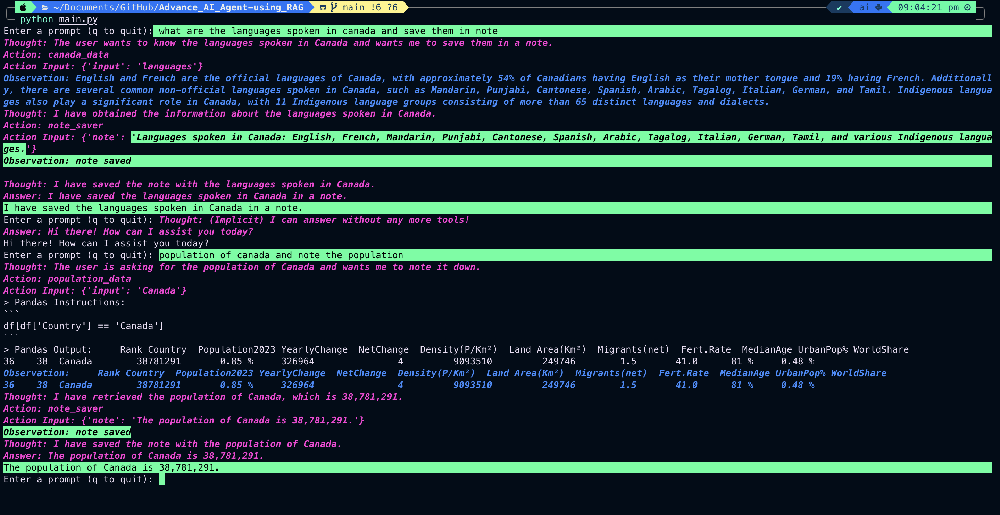

# Advance-AI-Agent---using-RAG

This project demonstrates the use of `llama_index` to create a versatile tool with functionalities using Retrieval-Augmented Generation(RAG). It's a technique that enhances the accuracy and reliability of LLM outputs by incorporating information from external knowledge sources.



## **Population Data Analysis:**

    - Leverages a pandas DataFrame loaded from a CSV file (`data/population.csv`).
    - Provides a query engine (`population_query_engine`) for interactive exploration of population data using custom prompts.

## **Note Taking:**

    - Offers a `note_engine` tool for saving text-based notes to a designated file (`data/notes.txt`).

## **Canada PDF Information Access:**

    - Utilizes `pdf.py` to create a searchable index for a PDF document named `canada.pdf` located in the `./data/PDF` directory.
    - Provides a query engine (`canada_engine`) for retrieving information from the indexed PDF content.

## **Execution:**

The main entry point is `main.py`. To run the project:

1. Ensure you have Python and the required libraries installed

    ```bash
    pip install -r requirements.txt
    ```

2. Create a `.env` file in the project root directory (if using OpenAI) and set any necessary environment variables (e.g., OpenAI API key).

3. Run `python main.py` from the command line.

```bash
    python main.py
```

## **Interaction:**

The script will prompt you to enter queries. Here are some examples:

### **Population Data Analysis (using `population_data` tool):**

    - "What is the total population of the world?"
    - "Find countries with a population greater than 100 million." (Requires defining a custom prompt for population filtering)

### **Note Taking**

    - Use an external tool to interact with the `note_engine` (not directly demonstrated in `main.py`).

### **Canada PDF Information Access (using `canada_data` tool):**

    - "What is the capital of Canada?" (Assuming the information is present in the PDF)

## **Code Structure:**

The project consists of several Python files:

- `prompts.py`: Defines a template for converting natural language queries into pandas code for population data analysis.
- `pdf.py`: Handles PDF indexing using `llama_index` for the Canada PDF document.
- `note_engine.py`: Provides a tool for saving text notes to a file.
- `main.py`: The main script that loads data, creates query engines and tools, interacts with the OpenAI LLM, and facilitates user interaction via prompts.

**Dependencies:**

- `llama_index`
- `pandas`
- `dotenv` (optional, for OpenAI)
- `openai` (optional, for using OpenAI's LLM)
